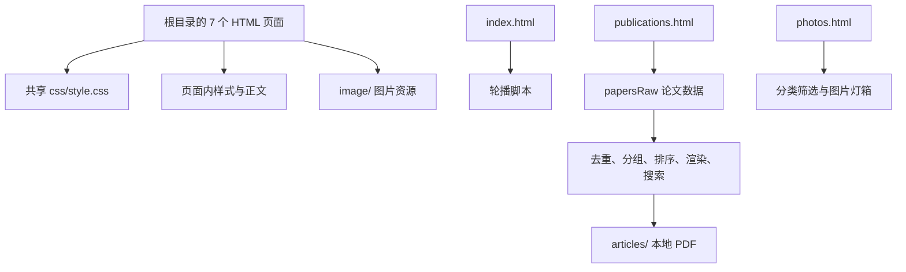

# Zhou Group 网站架构与维护说明

整理日期：2026-09-21。代码基线：`main` 分支，提交 `67f7b71`。

本说明来自本地源码、资源引用和 Git 历史检查。未核实线上页面、GitHub Pages 后台、DNS 或外部链接可用性。以下数量是本次检查的快照，内容更新后应重新统计。

## 1. 网站如何运行

这是原生 HTML、CSS、JavaScript 组成的多页面静态网站。各页面是可直接提供给浏览器的源文件，没有应用后端、数据库、CMS、前端框架、包管理配置或本地构建步骤。仓库中未发现 `.github/workflows`、Jekyll 配置或自动化测试配置。

- 7 个页面均位于根目录，通过普通相对链接跳转。
- 所有页面加载 `css/style.css`，除首页外，各页面还包含自己的 `<style>`。
- JavaScript 写在页面底部，没有独立 JS 文件、外部脚本依赖或内容 API。
- 图片、视频放在 `image/`，论文 PDF 放在 `articles/`。
- 远程仓库为 `xjiphys/xjiphys.github.io`，`CNAME` 内容为 `zhouphy.com`。这些信息指向 GitHub Pages 用途，但实际发布分支、目录和触发方式需要从仓库设置确认。
- `README.md` 中的 “test website” 是现有说明，不能据此判断线上站点是否仍为测试用途。



## 2. 文件与职责

| 文件/目录 | 职责与维护入口 |
| --- | --- |
| `index.html` | 首页：9 张轮播图、研究简介、3 个研究方向、5 项 Highlights、58 条新闻摘要 |
| `news.html` | 完整新闻时间线，按年份组织；当前 65 条，直接编辑 HTML |
| `research.html` | 3 个研究主题、相关论文链接、Methods Development 图片 |
| `publications.html` | 论文样式、`papersRaw` 数据、列表生成、作者高亮、搜索与编号 |
| `people.html` | Group Leader、Assistant Researcher、Post-doctor、PhD student、Alumni，直接编辑 HTML |
| `photos.html` | 18 张照片：Academic 10、Social 3、Vigor 5；分类按钮、计数、灯箱 |
| `openings.html` | 中文招聘内容，6 个锚点章节；右侧目录与邮件申请链接 |
| `css/style.css` | 配色、字体、导航、首页布局、人员卡片、页脚及响应式规则 |
| `image/base/` | Logo、首页研究方向图等基础图片 |
| `image/top/` | 首页轮播图片 |
| `image/highlight/` | 首页论文亮点配图，含 GIF |
| `image/people/` | 人员照片 |
| `image/research/` | 研究主题与方法图片 |
| `image/news/` | 新闻附图 |
| `image/photos/` | 相册图片，含分类目录及 `hkaps2026/` 活动目录 |
| `articles/` | 48 个 PDF 文件及 3 份人工维护记录 |
| `CNAME` | 自定义域名配置 |
| `README.md` | 项目简介与历史更新日志 |

图片实际存储目录不决定相册分类；页面卡片的 `data-cat` 才决定筛选结果。

## 3. 共享布局与样式

`css/style.css` 的 `:root` 定义全站设计变量：酒红主色 `#92071c`、深酒红 `#7a0617`、金色强调色 `#fdb837`、米白背景、字体和圆角。主体通常以 1300px 为最大宽度，导航最大宽度为 1400px。

导航使用 Flex 换行适配窄屏：1100px 以下将 Logo 与菜单分行，600px 以下缩小字号和 Logo。当前没有实际使用的汉堡菜单；`research.html` 的 `.menu-toggle` 脚本因页面没有相应按钮而不执行。

导航和页脚分别复制在 7 个 HTML 中，没有共享模板。修改导航项目、联系方式或页脚时要同步检查全部页面；当前页使用 `nav-item--active` 标记。

维护样式时同时检查共享 CSS 和页面内 CSS。News、Photos、Publications、Openings 多数样式带页面前缀；共享 `.hero` 也会作用于招聘页同名区块。页面 CSS 变量覆盖可能让全局配色修改只在部分区域生效。

## 4. 论文数据与显示规则

数据入口为 `publications.html` 内的 `const papersRaw = [...]`，不是 `articles/` 中的 Markdown 文件。当前 68 条记录，按去除首尾空白、合并连续空白、忽略大小写后的标题统计，也为 68 条。

| 字段 | 用途 |
| --- | --- |
| `year` | 年份分组；缺失时归入 Unknown year |
| `title` | 论文标题，也是去重依据 |
| `authors` | 作者字符串，渲染时按名单高亮 |
| `venue` | 期刊、卷页、年份或预印本信息 |
| `paperUrl` | 点击期刊信息跳转的文章/DOI 页面 |
| `pdfUrl` | 点击标题打开的本地 PDF 相对路径；没有此字段时标题为普通文本 |
| `badges` | Editors' Suggestion 等纯文字标记数组 |
| `links` | 额外链接数组，每项使用 `label` 和 `href` |

脚本处理顺序：

1. 用规范化标题去重。发生重复时按 `richnessScore` 保留一条；它不合并字段，也不计入 `pdfUrl`、`paperUrl`，所以更新论文应优先修改原记录。
2. 按年份倒序分组；同年正式发表的文章排在 `venue` 含 `arxiv` 或 `preprint` 的记录之前，再按标题排序。数组中的插入位置不决定最终显示位置。
3. 生成 `#pubRoot` 中的列表。标题链接 PDF，期刊信息链接文章网页，二者功能不同。
4. `highlightAuthors()` 高亮 PI 与名单中的成员；另一个 `highlightPI()` 函数当前没有被调用。
5. 搜索采用不区分大小写的连续子串匹配，覆盖标题、作者、期刊、徽章和附加链接标签；年份没有被单独加入搜索文本。搜索会隐藏空年份分组，并对可见条目重新倒序编号。因此序号不是固定论文 ID。

当前 47 条记录有本地 PDF，文件均存在；21 条没有本地 PDF。仓库还有一个未被论文数据引用的 `Yang2025HydrogenChains.pdf`，现行条目引用的是 `Yang2026HydrogenChains.pdf`。README 曾记录二者需人工比较，不能仅因未引用就删除旧文件。

新增论文时沿用 `AuthorYearKeyword.pdf` 命名习惯，核对年份、作者顺序、通讯作者符号、题名、期刊、DOI 和 PDF 的对应关系。将预印本更新为正式论文时，同时检查 News、首页新闻和 Highlights 是否需要同步。

## 5. 日常更新路径

### 新闻

- 完整内容编辑 `news.html` 对应年份下的 `li.news-item`，维护 `<time datetime="YYYY-MM-DD">` 和显示日期。
- 首页摘要编辑 `index.html` 的 `#B1` 列表，日期使用 `span.date`。
- 两处是独立手写内容，不会自动同步，现有条目数量也不同。应按同一事件核对日期、事实和链接。
- 新闻附图放入 `image/news/`；需要出现在相册的活动照片，还要编辑 `photos.html`。

### 人员

- 在 `people.html` 正确类别下维护照片及简介，照片放入 `image/people/`。
- 姓名在论文中需要高亮时，维护 `publications.html` 的 `PI_NAMES` / `OTHER_NAMES`。
- 作者字符串存在全名、缩写和 `Surname, Givenname and ...` 等不同格式，当前高亮不能覆盖所有格式。
- 当前姓名存在 Chen/Cheng 等跨页面拼写差异；更改人员资料前按本人提供的信息核实。

### 相册

- 沿用 `article.photo > .media > img` 与 `p.cap` 结构。
- `data-cat` 使用 `academic`、`social` 或 `vigor`，与筛选按钮的 `data-filter-link` 一致。
- 新卡片会自动参与计数、分类和灯箱，无须手改总数。
- 图片使用 `loading="lazy"`；卡片按 4:3 裁切，灯箱展示同一张图片的完整比例。
- 当前筛选只隐藏卡片，不隐藏空分类标题。关闭灯箱依赖点击背景或关闭符号，没有 Escape 或焦点管理逻辑。

### 首页与研究方向

- 轮播按 `.hero .TopPhoto` 的 DOM 顺序播放，每 4 秒切换一次，手动切换会重置计时器；淡入淡出由 CSS 控制。
- 第一张轮播图带 `is-active`，首页 `<head>` 有图片预加载，换图时一起检查。
- 研究简介分布于首页、Research 和 Openings；三处内容不自动同步。
- Highlights 是首页手写卡片，不由论文数组生成。

### 招聘与联系方式

- 招聘正文在 `openings.html` 的 `#sec1` 至 `#sec6`，目录使用相同锚点。
- 申请按钮使用 `mailto:`，网站没有收件后台。
- 修改导师简介、引用量、h-index、招聘条件或待遇时，检查 People、Publications 及其他相关页面中的重复信息；统计数据保留核实日期。

## 6. 已发现的问题与维护注意点

以下是现状记录，本次未修复页面：

| 问题 | 位置与影响 |
| --- | --- |
| 联系页缺失 | 7 个页脚均链接 `contact-us.html`，仓库中没有该文件 |
| 两处 PRL 链接与显示信息互换 | `research.html` 的 Topics 1、3：显示 124, 137001 的链接指向 125, 157402，显示 125, 157402 的链接指向 124, 137001；与 Publications 的对应关系也不一致 |
| People 缺少 viewport | `people.html` 的 `<head>` 没有 viewport meta，手机可能按桌面视口缩放；该页面还缺少 `lang` 属性 |
| 缺失背景图片 | `css/style.css` 的 `.Leaderp1` 引用了不存在的 `image/groupleader.jpg`；People 内实际头像文件仍存在 |
| CSS 变量自引用 | `photos.html` 中 `--surface: var(--surface)`、`--text: var(--text)`、`--muted: var(--muted)` 构成循环引用，需要改为继承或不同变量名 |
| HTML 标记与遗留代码 | Photos 有多余 `</article>`，People 有多余 `</a>` 和未显式闭合的容器；修复时需检查浏览器实际 DOM |
| 无效/重复 CSS | 共享 CSS 的 `padding-top: 1 0px` 无效；`.slider-btn` 有两段重叠声明，后一段覆盖前一段 |
| JavaScript 依赖 | Publications 的 HTML 容器初始为空，脚本失败或禁用时不会显示论文列表 |
| 手工统计与记录 | Publications 的引用量与 h-index 是标注 02/2026 的手写数据；`articles/*.md` 是历史人工记录，不会自动随网站更新 |
| 仓库杂项 | 9 个 `.DS_Store` 被 Git 跟踪，未发现 `.gitignore` |

`articles/scholar_missing_review.md` 记录了 2026-07-04 的 13 个候选条目，含可能重复项、会议摘要等，不能当作已确认待发表列表批量加入。

## 7. 本地预览、检查与发布

在仓库根目录可用 Python 标准库启动本地预览，不需要安装网站依赖：

```sh
python3 -m http.server 8000 --bind 127.0.0.1
```

然后访问 `http://127.0.0.1:8000/`。结束时在启动服务器的终端按 Ctrl+C。

每次维护按改动范围检查：

1. 查看 `git status`，保留已有未提交修改。
2. 修改对应源文件并检查需要同步的位置；文件名与引用大小写必须一致。
3. 检查新增链接、图片、PDF、锚点和 JavaScript 语法。
4. 内容或布局变更后，预览受影响页面的桌面与手机宽度；公共样式变更时检查全部 7 页。
5. 涉及交互时检查轮播、论文搜索/编号/PDF 跳转、相册筛选/计数/灯箱，以及浏览器报错。
6. 检查 `git diff --check` 与实际 diff，按现有习惯补充 README 日志。
7. 需要发布时先确认实际 Pages 来源，再按该流程提交、推送和核对线上结果。本次没有执行提交、推送或部署。

文件换行格式混合：Index、Publications 为 LF；People、Research、Photos、Openings 和共享 CSS 为 CRLF；News 主要为 CRLF，夹有 LF。局部修改时保留现有格式，避免整页无意义 diff。

本次完成的检查：7 页 HTML 资源与锚点扫描、共享 CSS 的资源引用扫描、论文数据解析与数量核对、47 个 PDF 路径存在性检查、4 段有效内联脚本的 Node.js 语法检查。未执行浏览器视觉验收或外链联网验证，因此这些检查不代表线上页面与全部交互均已通过验证。
